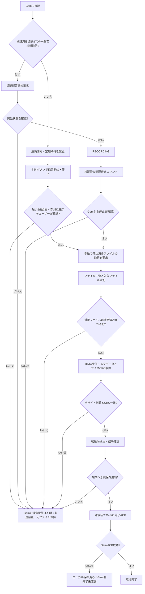

# Memoket Gem — 録音から取得完了までの状態フロー（設計見直し 0.7.90）

> 遠隔停止は未検証。BLE CCCD DATA通知OFF/ON、GATT切断、転送量、ファイル一覧応答は録音停止の証拠ではない。
> 開始応答 03ff も本体物理状態の継続確認とは区別する。

## 独立した状態の定義

- Gem本体の録音状態：UNKNOWN / RECORDING / STOP_REQUESTED / STOP_CONFIRMED。BLE接続、通知CCCD成功、ローカル画面表示だけではSTOP_CONFIRMEDにしない。
- ファイル状態：UNLISTED / LISTED / RECEIVING / SIZE_CRC_KNOWN / VERIFIED / FINALIZED / SAVED / ACKED。
- Gem削除状態：UNKNOWN / ACK_ACCEPTED / POST_LIST_CONFIRMED。ACK_ACCEPTEDだけで本体からの実削除まで断言しない。
- 転送UI：転送件数・受信バイト・最終進捗時刻・異常原因を表示。無限取得させない。

## 欠陥と未解決事項

1. 0.7.89までは遠隔開始だけ提供し、停止は本体頼りだった。遠隔停止と録音状態取得の両方を実機検証するまで遠隔開始を禁止する。
2. 0.7.88は通知OFFだけでは停止できず、そのまま別接続で転送を開始して約224KBで異常終了した。CCCDを停止コマンドと扱わない。
3. ファイル名タイムスタンプ±10秒だけで当該録音の同一性を証明できない。確定ファイルID・セッション識別の仕様調査が必要。
4. MemoketGattSyncの固定120秒timeoutは長い録音には非対応。完全な進捗監視・中断・再開、バックグラウンド処理の制約を再設計するまで長時間録音取得の完了は保証しない。
5. 0x01がDATAの配信を開始する場合、0x02メタデータ問い合わせが250ms無通信待ちに依存しており、録音中の継続配信では成立しない。録音停止確認を前提に別工程として検証する。
6. 端末への保存、CRC一致、転送finalize応答、Gem ACK受理、Gem本体からの削除確認は別イベントで記録する。
7. 定期取得は装置の実際の録音状態を照会する仕組みが検証されるまで無効化する。

## 0.7.90のスコープ

- **実装済みの安全策**：未検証の遠隔開始をブロック、定期取得をブロック、ユーザーが本体で停止を明示確認した場合だけ手動取得を登録、旧自動WorkもconfirmedStopped無しでは取得不可。
- **未解決**：真の遠隔停止BLEコマンドと状態readback、録音ごとのファイルID、長時間・バックグラウンドでの転送安定性、削除の再確認。
- 本実装を「遠隔停止修正済み」とは称さない。実機検証が完了するまでは録音はGem本体のボタンで行う。
